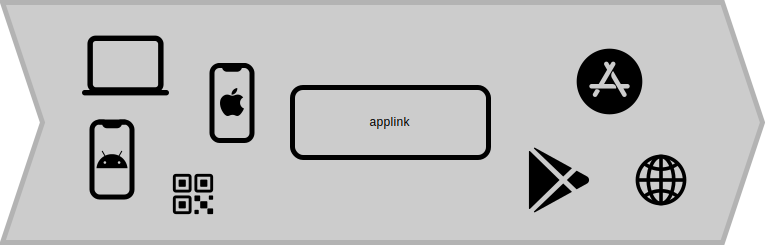

# applink

> One shareable link to all your app market listings 



 - **Automatic Device Detection**: Redirect users to the correct app market (Google Play or Apple App Store) based on the device type found within the HTTP user agent string.
 - **Fallback Option**: If automatic detection fails, users are directed to a webpage for manual app store selection.
 - **Optimized Previews**: Link previews for messengers and social media, powered by Open Graph Protocol, to enhance engagement.
 - **Easy Deployment**: Deploy applink microservice as a single, easy-to-configure Docker image.

## Use cases

 - **Marketing Campaigns**: Share a single link in emails, social media posts, or ads to direct users to your app.
 - **Print Materials**: Use a single QR code linking to your app, perfect for brochures, posters, and flyers.
 - **In-App Recommendations**: Share a link from within your app via messengers or social media, making it easy for users to recommend your app to others.

## Example usage

Within the git project root, the following docker command, starts the service with the configuration found in `example_storage` directory:

```
docker run --rm -it -p 9080:80 -v $(pwd)/docs/example_storage:/applink/storage stefanhuber332/applink
```

Opening the link [http://localhost:9080/myapp](http://localhost:9080/myapp) shows the fallback page inside the browser. If the link is opened with an Android or iOS device the respective redirect to the app market is executed.

### Configuration

A full configuration of the applink service requires a directory which is mounted as a volume to the docker container. The directory structure would look something like this:

```
configuration/
  app1.yml
  app2.yml
  ...
icons/
  app1-icon.png
  app2-icon.png
  ...
```

Within the `configuration` subdirectory a `yml` file for each app needs to be added. The filename of the `yml` file corresponds to the `path` in the applink (e.g., `https://applink.example.com/app1`). Within the `icons` subfolder icon images can be placed, which will be served to users. 

### Example

Within the `docs/example_storage` directory a full example is available. 

```yml
links:
  ios: https://apps.apple.com/de/app/festung-kufstein/id1090047406?platform=iphone
  android: https://play.google.com/store/apps/details?id=at.beyondit.audioguide
page:
  base-url: http://localhost:9080
  title: My Example App
  background-color: 'linear-gradient(90deg, rgba(2,0,36,1) 0%, rgba(50,217,218,1) 56%, rgba(0,212,255,1) 100%)'
  app-icon: example_icon.png
```

## Local development (Nginx Unit and PHP)

Nginx Unit cannot be used on Windows outside a Docker container, but MacOS and Linux is supported. Follow the instruction to install on your environment ([https://unit.nginx.org/installation](https://unit.nginx.org/installation)). The `php` language module for unit is required.

Start unit with control port on `9090`:

```
unitd --control 127.0.0.1:9090 --pid $(pwd)/unit.pwd --log $(pwd)/unit.log --no-daemon
```

Push local unit configuration for the application:

```
curl -X PUT -d "@unit-config-local.json" 127.0.0.1:9090/config
```

## Local development (PHP only)

Locally install a php interpreter and start the built-in webserver from the root directory of the project:

```
php -S localhost:8080 -t ./public
```
